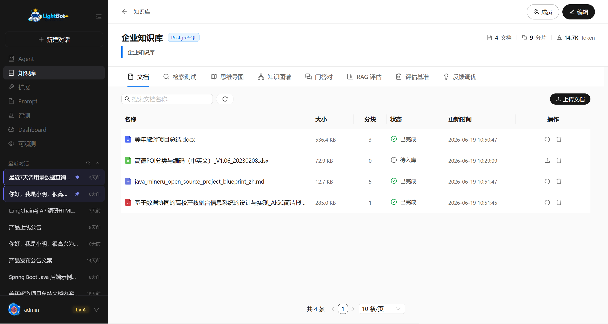
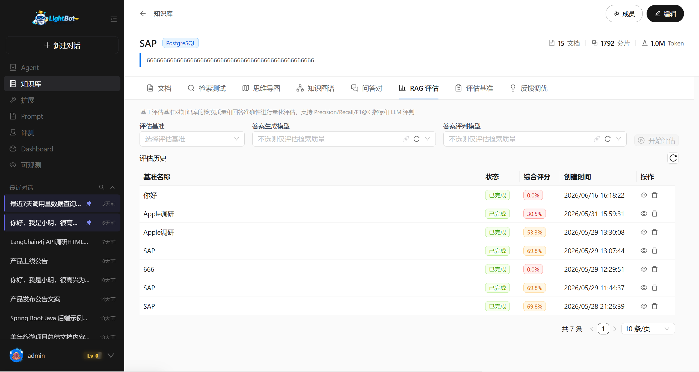
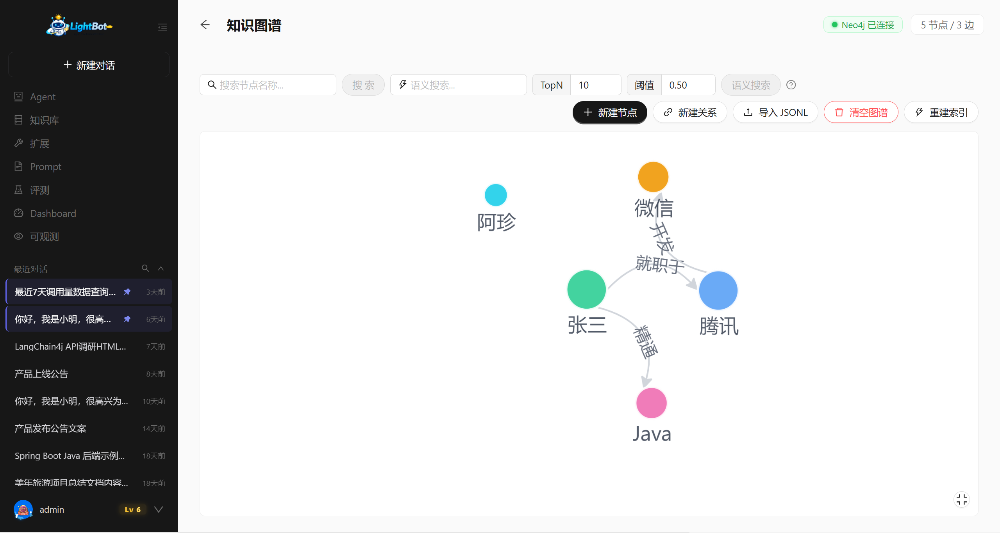
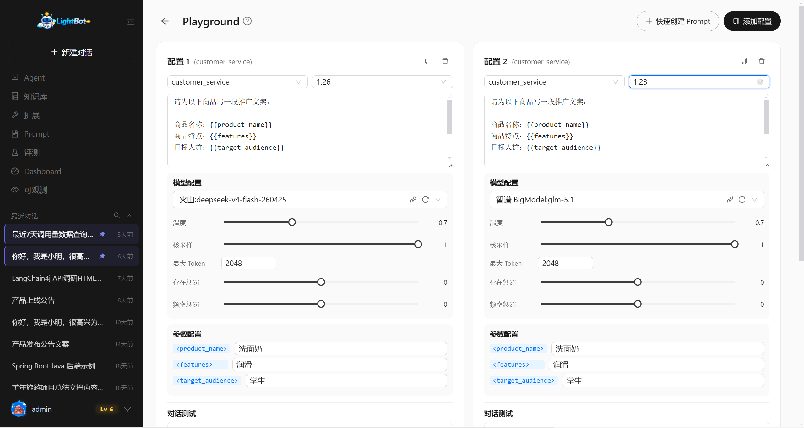
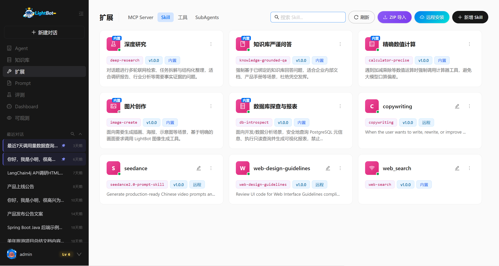
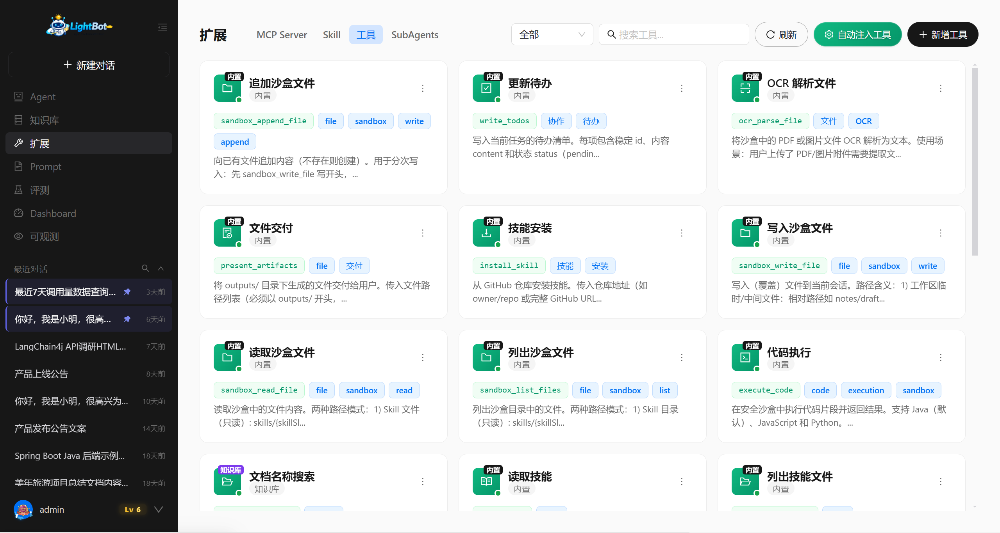
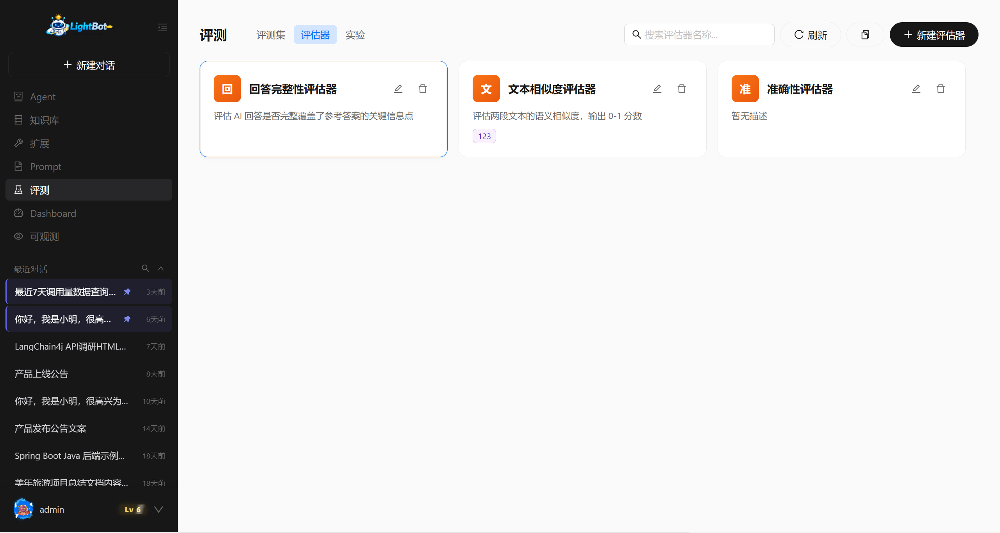
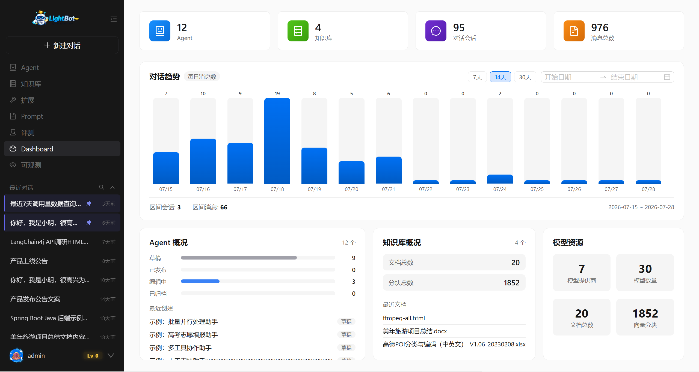
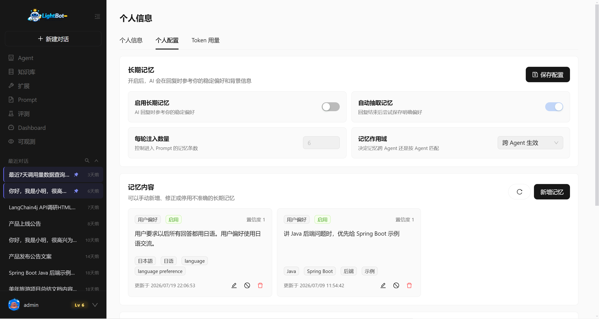

<p align="center">
  
</p>

<h1 align="center">LightBot</h1>

<p align="center">
  <strong>面向 Java 团队的 AI Agent 应用开发平台</strong>
</p>

<p align="center">
  用 Agent、Workflow、RAG 与工具生态，把 AI 能力做成可交付、可治理的应用。
</p>

<p align="center">
  <a href="QUICKSTART.md">快速启动</a> ·
  <a href="docs/deployment.md">部署指南</a> ·
  <a href="docs/architecture/module-boundaries.md">模块边界</a> ·
  <a href="sql/README.md">数据库与迁移</a> ·
  <a href="ROADMAP.md">Roadmap</a> ·
  <a href="LICENSE">Apache-2.0</a>
</p>

---

## 项目定位

LightBot 是一个 Java First 的 AI Agent 平台，服务于需要将大模型能力接入现有业务、并持续运营 AI 应用的团队。它不是单一聊天界面，也不要求一开始就采用复杂的分布式架构：项目以 Spring Boot 单体部署为起点，以清晰的 Maven 模块边界承载后续演进。

适用场景包括智能客服、企业知识问答、流程自动化、内部研发助手，以及需要工具调用、工作流编排和运行治理的 AI 应用。

## 项目演示

| 平台概览 | Agent 配置与版本 |
| :---: | :---: |
|  |  |

| Agent 流式对话 | Workflow 可视化编排 |
| :---: | :---: |
|  |  |

| 知识库 | RAG 评估 |
| :---: | :---: |
|  |  |

| 知识图谱 | Prompt Playground |
| :---: | :---: |
|  |  |

| 扩展（Skill / MCP / SubAgent） | 工具管理 |
| :---: | :---: |
|  |  |

| 评测集、评估器与实验 | 可观测性 Trace |
| :---: | :---: |
|  |  |

| Dashboard | 个人中心与安全设置 |
| :---: | :---: |
|  |  |

## 核心能力

| 能力域 | 说明 |
| --- | --- |
| Agent 与对话 | Agent 创建、配置与版本管理；SSE 流式对话、会话管理、长期记忆、附件与资源提及（@）；多轮 Tool / Skill / SubAgent 调用。 |
| Workflow 编排 | 可视化 DAG；条件、分类、检索、工具、脚本、人工确认、嵌套子工作流；节点超时/重试、调试、回放与测试历史；支持 Dify 工作流 YAML 导入与导出。 |
| 知识库与 RAG | 文档解析、OCR、分块、向量/关键词检索、Rerank、问答对、检索测试；可连接 Dify Dataset 作为只读知识源。 |
| 知识图谱 | 实体/关系抽取、图构建与可视化；图谱检索（含全局图谱视图），与向量检索互补。 |
| 工具 | 内置工具与 API 工具、JSON Schema 入参、调用记录与按用户/工具维度限流。 |
| 扩展能力 | MCP（stdio / SSE / Streamable HTTP）、Skill（ZIP 导入 / 远程安装）、SubAgent 协作与并行委派。 |
| 模型管理 | OpenAI 兼容、DashScope 等提供商接入；连通性测试、动态模型路由、模型能力与默认模型管理。 |
| Prompt 工程 | Prompt 模板、变量、版本管理；Playground 调试与参数配置。 |
| 评测 | 评测集与版本、评估器、实验与结果对比；知识库侧 RAG Benchmark 与评测报告。 |
| 可观测性 | LLM Trace、工作流与工具调用链路、实时日志、Token 用量统计。 |
| 任务中心 | Redis Stream 任务队列；进度追踪、取消、重试/延迟、死信与僵尸任务扫描。 |
| Dashboard | 平台资源与运行指标聚合（Agent、知识库、任务、调用量等）。 |
| 个人中心 | 个人资料与偏好、会话导出；角色权限、API Key 作用域与Token配额。 |

## 技术栈

| 层级 | 技术选型 |
| --- | --- |
| 后端 | Java 17、Spring Boot 3.3.6、Spring AI 1.1.8、MyBatis-Plus 3.5.9 |
| 前端 | Vue 3、Vite、Ant Design Vue、Vue Flow、Pinia、pnpm |
| 数据与存储 | PostgreSQL 15 + pgvector、Redis 7、MinIO、Milvus、Neo4j |
| 协议与治理 | SSE、MCP、Sa-Token、SpringDoc OpenAPI、Redis Stream |

## 架构与模块

```text
Vue 3 + Ant Design Vue
        │ HTTP / SSE
        ▼
lightbot-server        HTTP 入口、配置、拦截器
        ▼
lightbot-agent         Agent / Chat 运行时
        ▼
lightbot-workflow      Workflow DSL、图校验、节点处理
        ▼
lightbot-tool          Tool / MCP / Skill / SubAgent
        ▼
lightbot-knowledge     RAG、文档、图谱、评测
        ▼
lightbot-ai            模型工厂、Prompt、LLM Trace
        ▼
lightbot-platform      用户、任务、系统配置、API Key、Dashboard
        ▼
lightbot-framework → lightbot-common
```

依赖方向固定为 `common → framework → platform → ai → knowledge → tool → workflow → agent → server`。下层不依赖上层；跨模块能力通过接口或 Port 暴露，详见[模块边界说明](docs/architecture/module-boundaries.md)。

## 快速启动

开发环境最少需要 JDK 17、Maven 3.9+、Node.js 20+、pnpm、PostgreSQL 15（含 pgvector）、Redis 7，以及一个可用的模型 API Key。

```bash
# 1. 初始化全新数据库（会创建 lightbot 数据库）
psql -v ON_ERROR_STOP=1 -U postgres -h localhost -f sql/2026-07-28-init.sql
# 2. 写入预制数据
psql -v ON_ERROR_STOP=1 -U postgres -h localhost -d lightbot -f sql/insert-sql.sql

# 3. 配置模型密钥（PowerShell 示例）
$env:DASHSCOPE_API_KEY = "sk-xxx"

# 4. 启动后端（仓库根目录）
mvn -pl lightbot-server -am spring-boot:run

# 5. 启动前端（另开终端）
cd lightbot-ui
pnpm install
pnpm dev
```

- 前端：<http://localhost:5173>
- 后端：<http://localhost:8081>
- OpenAPI：<http://localhost:8081/swagger-ui.html>

完整的本机配置、中间件可用范围、首次使用和排障说明见[快速启动](QUICKSTART.md)；生产环境请使用[部署指南](docs/deployment.md)。

## 数据库与升级

- 全新安装依次执行 `sql/2026-07-28-init.sql`（DDL）与 `sql/insert-sql.sql`（预制数据）。
- 已部署环境只按日期顺序执行尚未应用的增量迁移，**不要**重跑基线 init。
- 基线固定两个 SQL：带日期的全量 DDL，以及 `insert-sql.sql`。

详情见[SQL 迁移说明](sql/README.md)与[SQL 模块索引](sql/module-index.md)。

## 项目愿景

LightBot 希望成为 Java 团队构建 AI 应用的可靠底座：让模型、知识、工具与流程能够在同一平台中组合，同时让权限、成本、运行状态和后续演进保持可控。我们优先保证业务落地的简单性，再随着真实的容量与组织需求演进架构。

## 参与贡献

提交前请确认模块依赖方向、SQL 迁移命名和文档链接均符合约定。版本发布流程见[发布清单](docs/RELEASE.md)，后续计划见[Roadmap](ROADMAP.md)。

## License

本项目采用 [Apache License 2.0](LICENSE) 开源。

## 关注我

了解本项目设计思路、更多信息等，欢迎关注作者的公众号：正在绘制中 

<p align="center">
  
</p>

